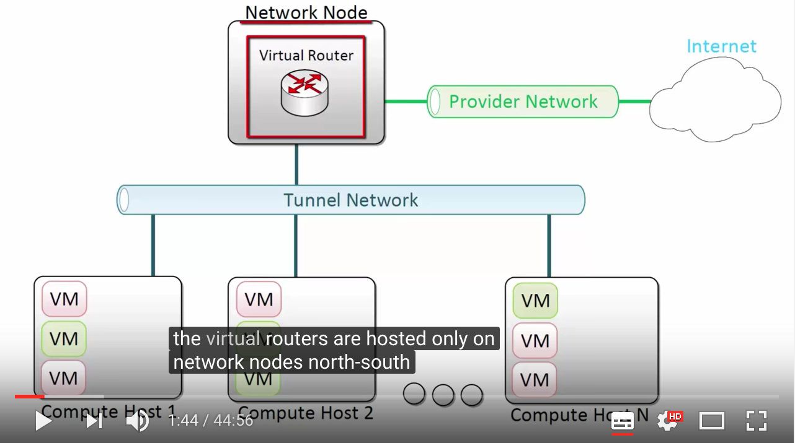

### DVR

  - Neutron brfor DVR and wwith DVR any traffic that needs to be routed has to go through a virtual router
before DVR the virtual router are hosted only on network nodes north-south traffic from VM .
Change with DVR enabled with DVR recompute host can have instances of the same new sean router locally on the host , this means the virtual router and multiple compute has the same interface IP and Mac address now traffic between VMs and different subnets can be rights locally in a computer host and does not has to go up to the network node also north-south traffic for VMs assigned floating appease can be righted locally before heading to external destination . with DVR the  scenario that still requires going to the network node is north-south traffic for VMs without floating eye peas or a fixed IP is only lab setup if 

  
 

